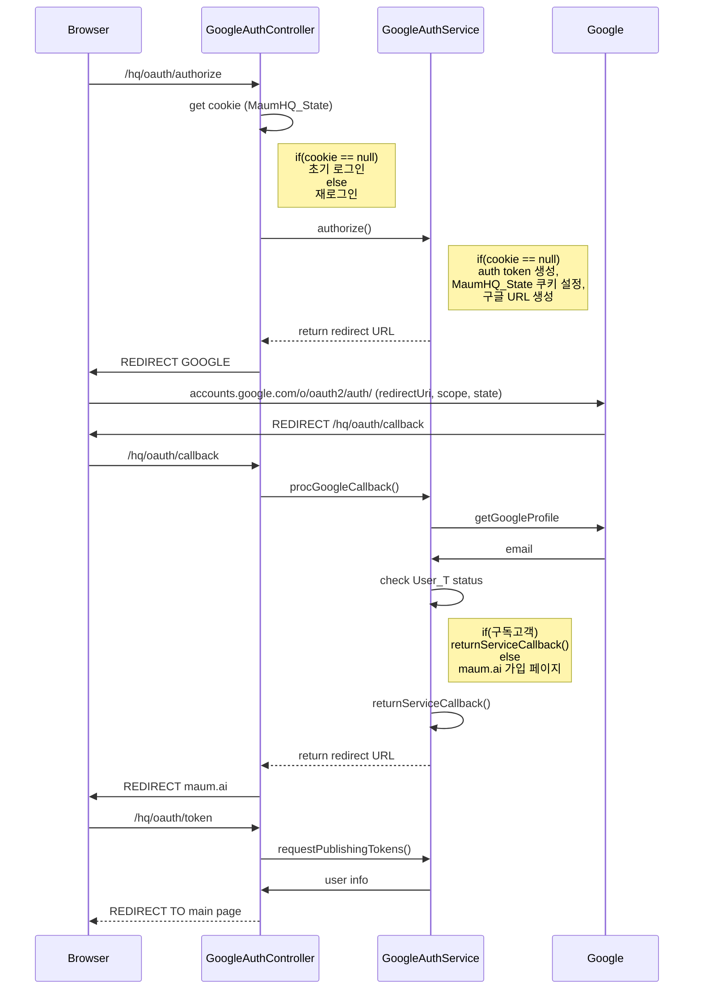
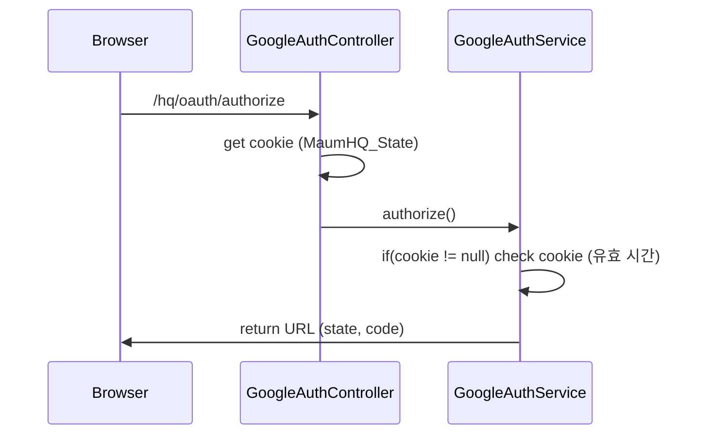

## Service Architecture
-  구글 초기 로그인


- 회원가입 유도
```mermaid
sequenceDiagram
Browser ->> maum.ai : 가입
maum.ai ->> Browser : return redirect URL
Browser ->> GoogleAuthController : /hq/oauth/signup-member-callback
GoogleAuthController ->> GoogleAuthService : returnServiceCallback()
GoogleAuthService ->> GoogleAuthController : return redirect URL
GoogleAuthController ->> Browser : return redirect URL
Browser ->> GoogleAuthC

```

- 구글 재로그인


## Database
- SSO_AUTHLOG
자체 가입 회원의 인증 정보

|name         	|type   	 |desc                           |
|---------------|------------|-------------------------------|
|ID          	|bigint|아이디|
|EMAIL			|varchar(100)|이메일            |
|NAME          	|varchar(100)|이름            |
|AUTH_TYPE      |varchar(100)|인증 타입(회원가입, 비밀번호 변경)|
|AUTH_STATUS    |varchar(100)|인증 상태 (전, 후, 만료)|
|AUTH_KEY       |varchar(100)|인증 키|
|EXPIRE_DATE    |datetime	 |인증키 만료 일시|
|REG_DATE       |datetime    |생성 일시|
|MDF_DATE       |datetime    |수정 일시|
|CERT_DATE      |datetime    |이메일 등록 확정 일시|

- SSO_USER
자체 회원 정보

|name         			 	 |type  	 	|desc                           |
|----------------------------|--------------|-------------------------------|
|ID          				 |bigint		|아이디|
|EMAIL						 |varchar(100)	|이메일            |
|PASSWORD					 |varchar(100)	|비밀번호            |
|NAME          				 |varchar(30)	|이름            |
|PHONE         				 |varchar(30)	|연락처            |
|REGISTER_PATH  		 	 |varchar(100)	|가입 경로|
|TERMS_AGREE    			 |int			|약관 동의|
|PRIVACY_AGREE    			 |int			|개인 정보 동의|
|MARKETING_AGREE			 |int			|마케팅 동의|
|REG_DATE			         |datetime 		|생성 일시|
|MDF_DATE       			 |datetime    	|수정 일시|
|UPDATE_PASSWORD_DATE        |datetime    	|마지막 비밀번호 변경 일자|
|ACCOUNT_STATUS 			 |varchar(20)  	|계정의 등록 상태(인증 전, 후, 휴면)|
|LAST_LOGIN    				 |datetime	 	|마지막 로그인 시각|
|COMPANY      				 |varchar(50)	|회사|
|PRIVACY_AGREE_DATE      	 |datetime    	|개인 정보 동의 일자|

- SSO_USER_HISTORY
SSO를 통해 로그인한 사용자 기록

|name         	|type   	 |desc                           |
|---------------|------------|-------------------------------|
|ID          	|bigint		 |아이디|
|EMAIL			|varchar(100)|이메일            |
|REG_DATE		|datetime    |생성 일시|

- User_T
maum.ai의 사용자 관리

|name         	|type   	 |desc                           |
|---------------|------------|-------------------------------|
|ID          	|bigint		|아이디|
|UserNo         |bigint		|아이디|
|Password		|nvarchar(200)| 비밀번호|
|Email			|nvarchar(70)		|이메일|
|Phone			|nvarchar(15)|연락처|
|Grade			|int|회원 등급|
|Product		|int|이용상품 정보(Product_T join key)|
|Enabled		|int||
|Authority		|nvarchar(20)||
|Type			|int|회원분류|
|Limit			|int||
|Account		|nvarchar(50)|회사명|
|VoiceAgree		|int||
|PrivacyAgree	|int|개인정보 동의여부|
|PrivacyDate	|datetime|개인정보 동의일|
|LastLoginDate	|datetime|최근 로그인 날짜|
|LastLogoutDate	|datetime|최근 로그아웃 날짜|
|djangoid		|int|장고 기본 유저 ID값|
|Active			|int|휴면여부|
|CreateDate		|datetime|회원가입일|
|UpdateDate		|datetime|회원 정보 수정일|
|UpdateUser		|int|회원 정보 변경자|
|LKey			|nvarchar(200)||
|GKey			|nvarchar(200)||
|LoginFailCNT	|int||
|NationCD		|nvarchar(2)||
|Company		|nvarchar(50)||
|Job			|nvarchar(50)||
|CreateFlag		|int||
|CompanyEmail	|nvarchar(70)||
|ApiKey			|nvarchar(50)||
|ApiId			|nvarchar(50)||
|MarketingAgree	|int||
|Status			|int|구독상태|
|PayCount		|int|결제 횟수|
|AccessToken	|nvarchar(64)||
|AccessExpireTime|datetime||
|RefreshToken	|varchar(64)||
|RefreshExpireTime|datetime||
|Channel		|varchar(30)|로그인 인증 채널|

<!--stackedit_data:
eyJoaXN0b3J5IjpbLTE4NzEyMzAzOTcsLTI4MjYxNjQyMiwtMT
QxODE3ODUyOCwtMTkxODU2NzczNywtODA3NjY0OTkyLDQ5Mzgw
OTU0OF19
-->